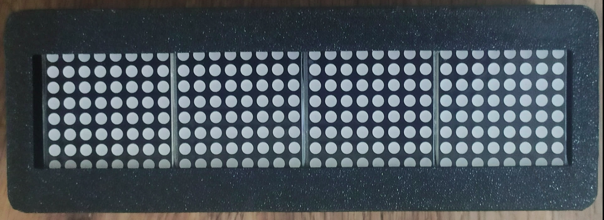

# ESP8266 Dot Matrix Project


This project uses an ESP8266 board to control an LED matrix via the MAX7219 module. It is designed to be compiled and uploaded with PlatformIO.

## Project Structure
- `src/` : Contains the main source code (e.g., `MAX7219_U8g2.ino`).
- `lib/` : Additional libraries.
- `include/` : Header files.
- `test/` : Unit or integration tests.
- `assets/` : Images and documentation resources.
- `platformio.ini` : PlatformIO configuration with dynamic build flags.
- `.env.example` : Template for environment configuration.
- `.env` : Your local WiFi/NTP configuration (gitignored for security).
- `requirements.txt` : Python dependencies including PlatformIO.

## Quick Start

### Option 1: Using Python requirements.txt (Recommended)
1. **Install Python dependencies** (includes PlatformIO):
   ```bash
   git clone <repo-url>
   cd dot_matrix_clock
   pip install -r requirements.txt
   ```

### Option 2: Manual PlatformIO installation
1. Install [PlatformIO](https://platformio.org/install) manually.
2. Clone this repository:
   ```bash
   git clone <repo-url>
   ```

### Configuration and Upload
1. **Configure WiFi credentials**:
   ```bash
   cp .env.example .env
   ```
   Edit `.env` with your WiFi credentials and timezone settings.
2. Open the folder in PlatformIO or VS Code.
3. Connect the ESP8266 and upload the firmware:
   ```bash
   pio run --target upload
   ```
4. **Optional** : Print the [3D enclosure](https://www.printables.com/model/1354766-simple-clock-with-4-blocks-of-8x8-dot-matrix-with) for a professional finish!

## Configuration

### WiFi and NTP Configuration - Native PlatformIO System

This project uses a **modern and simplified configuration system** that dynamically loads your settings from a `.env` file directly via PlatformIO, **without complex Python scripts**.

#### ✅ Advantages of this approach
- **Native PlatformIO**: Uses PlatformIO's built-in capabilities
- **Secure**: The `.env` file is ignored by git (your credentials stay local)
- **Simple**: No external scripts, just a configuration file
- **Flexible**: Default values if no `.env`, easy customization

#### 🚀 Quick Configuration

1. **Copy the example file**:
   ```bash
   cp .env.example .env
   ```

2. **Edit your settings** in `.env`:
   ```bash
   # PlatformIO Environment Variables
   # WiFi Configuration
   -D WIFI_SSID=\"YourWiFiNetwork\"
   -D WIFI_PASSWORD=\"YourPassword\"
   -D NTP_SERVER=\"europe.pool.ntp.org\"
   -D GMT_OFFSET_SEC=3600
   ```

3. **Compile and upload**:
   ```bash
   pio run --target upload
   ```

#### 🔧 How it works

**PlatformIO Integration** (`platformio.ini`):
```ini
[env:nodemcuv2]
platform = espressif8266
board = nodemcuv2  
framework = arduino
lib_deps = ...
; Dynamically loads build flags from .env file if it exists
build_flags = !test -f .env && cat .env | grep -v '^#' || echo ""
```

**Source Code** (`src/MAX7219_U8g2.ino`):
```cpp
// Build flags automatically become C++ macros
#ifndef WIFI_SSID
#define WIFI_SSID "YOUR_WIFI_SSID"    // Default value
#endif

#ifndef WIFI_PASSWORD  
#define WIFI_PASSWORD "YOUR_WIFI_PASSWORD"
#endif

#ifndef NTP_SERVER
#define NTP_SERVER "europe.pool.ntp.org"
#endif

#ifndef GMT_OFFSET_SEC
#define GMT_OFFSET_SEC 3600
#endif
```

#### 📋 Default values (if no `.env`)
- **WIFI_SSID**: `"YOUR_WIFI_SSID"`
- **WIFI_PASSWORD**: `"YOUR_WIFI_PASSWORD"`  
- **NTP_SERVER**: `"europe.pool.ntp.org"`
- **GMT_OFFSET_SEC**: `3600` (GMT+1)

#### 🛠️ Useful Commands
```bash
# Python environment setup
pip install -r requirements.txt

# PlatformIO commands
# Standard build
pio run

# Upload to ESP8266
pio run --target upload

# Clean + rebuild  
pio run --target clean && pio run

# Serial monitor
pio device monitor

# Development tools
flake8 .                     # Code linting
pylint src/                  # Code analysis
bandit -r .                  # Security scanning
pytest                       # Run tests (if any)
```

4. **Environment File Format** (`.env`):
   ```bash
   # Simple key=value format (no quotes needed)
   WIFI_SSID=MyNetwork
   WIFI_PASSWORD=MyPassword123
   NTP_SERVER=pool.ntp.org
   GMT_OFFSET_SEC=3600
   ```

This approach provides several advantages:
- ✅ **Secure**: No credentials in source code or git history
- ✅ **Automatic**: Works without manual intervention
- ✅ **Robust**: Falls back to safe defaults
- ✅ **Cross-platform**: Pure Python, works on Windows/Linux/macOS
- ✅ **CI/CD Friendly**: Compatible with GitHub Actions and automation

## Hardware Wiring

### MAX7219 LED Matrix Connection
Connect the MAX7219 module to your ESP8266 (NodeMCU v2) as follows:

| MAX7219 Pin | ESP8266 Pin | NodeMCU Pin | Description |
|-------------|-------------|-------------|-------------|
| VCC         | 3.3V        | 3V          | Power supply (3.3V) |
| GND         | GND         | GND         | Ground |
| DIN         | GPIO13      | D7          | Data input (MOSI) |
| CS          | GPIO12      | D6          | Chip select |
| CLK         | GPIO14      | D5          | Clock signal (SCK) |

### Configuration in Code
The pin configuration is defined in the source code:
```cpp
#define PIN_CLOCK 14  // GPIO14 (D5)
#define PIN_DATA  13  // GPIO13 (D7) 
#define PIN_CS    12  // GPIO12 (D6)
```

### Matrix Configuration
- **Display dimensions**: 32x8 pixels (4 modules of 8x8)
- **Module type**: MAX7219 controlled LED matrix
- **Communication**: SPI (Software SPI implementation)

## 3D Printed Enclosure

This project includes a **custom 3D printed enclosure** to create an elegant and compact clock with your LED matrix display.

### 🖨️ 3D Model Available

**Printables Link**: [Simple Clock with 4 blocks of 8x8 dot matrix](https://www.printables.com/model/1354766-simple-clock-with-4-blocks-of-8x8-dot-matrix-with)

### 📐 Enclosure Features

- **Compact design**: Perfectly fitted for 4x MAX7219 8x8 modules
- **Integrated support**: Built-in slots for ESP8266 (NodeMCU v2)
- **Easy access**: Openings for USB and power connections
- **Clean finish**: Hides cables and components
- **Stable**: Solid base for desktop use

### 🖼️ Project Preview

| Front View | Display Sample |
|------------|----------------|
|  |  |

### 🔧 Assembly Instructions

1. **Print the enclosure** from [Printables](https://www.printables.com/model/1354766-simple-clock-with-4-blocks-of-8x8-dot-matrix-with)
2. **Assemble the electronics** according to the wiring diagram above
3. **Install in the enclosure**:
   - Place the MAX7219 modules in their designated slots
   - Position the ESP8266 in its compartment
   - Route cables through the dedicated cable channels
4. **Finalize**: Close the enclosure and connect power

### 📋 Recommended Print Settings

- **Filament**: PLA or PETG
- **Layer height**: 0.2mm for good quality/speed balance
- **Supports**: Not required (optimized design)
- **Infill**: 15-20% sufficient

## Usage
The source code in `src/MAX7219_U8g2.ino` shows how to initialize and display patterns on the LED matrix.

## Security Features

This project includes comprehensive security measures to prevent accidental exposure of sensitive information:

### Automated Secret Detection with gitleaks
- **gitleaks Integration**: Fast and efficient secret scanning optimized for CI/CD pipelines
- **Custom IoT Configuration**: Specialized rules for ESP8266/IoT projects detecting WiFi credentials, API keys, and network identifiers
- **CI/CD Security Scan**: Automatic detection of secrets in all commits and pull requests
- **Daily Security Scans**: Scheduled scans to catch any newly introduced secrets

### Quick Setup
**Install the pre-commit hook** (gitleaks will be installed automatically if needed):
```bash
./install-hooks.sh
- ✅ Scan staged files for secrets before each commit
- ✅ Block commits containing potential secrets
- ✅ Provide helpful guidance for fixing issues

### Manual git-leaks Installation
If you prefer to install git-leaks manually:
- **macOS**: `brew install gitleaks`
- **Linux**: Download from [GitHub releases](https://github.com/gitleaks/gitleaks/releases)
- **Windows**: `winget install gitleaks`

### Local Secret Scanning
- **Full repository scan**: `gitleaks detect --config=.gitleaks.toml`
- **Staged files only**: `gitleaks protect --staged --config=.gitleaks.toml`
- **Specific file**: `gitleaks detect --config=.gitleaks.toml --source=filename`

### Detection Capabilities
The git-leaks configuration automatically detects:
- WiFi credentials (SSID/passwords)
- API keys and authentication tokens
- Real ISP network names (Livebox, Freebox, SFR, Orange, Bouygues)
- MAC addresses and IP addresses
- Long hexadecimal strings (potential encryption keys)
- Hardcoded secrets in source files

### Security Best Practices
- ✅ Always use `.env` files for local secrets (automatically ignored by git)
- ✅ Use placeholder values like `YOUR_WIFI_SSID` in examples
- ✅ Review security scan results in CI/CD
- ✅ Change any credentials that were accidentally committed
- ✅ Use the pre-commit hook to catch issues early

### CI/CD Workflows
This project includes multiple specialized GitHub Actions workflows:

#### 🔨 Build Workflow (`build-platformio.yml`)
- **Purpose**: Fast compilation and firmware generation
- **Triggers**: Push/PR to master branch
- **Features**: 
  - Optimized Python dependency caching via `actions/setup-python`
  - Automatic installation from `requirements.txt`
  - Artifact upload (firmware files)
  - Focused on compilation only

#### 🔒 Security Workflow (`security-scan.yml`)
- **Purpose**: Comprehensive security scanning
- **Triggers**: Push/PR, daily at 2 AM, manual dispatch
- **Features**:
  - git-leaks secret detection
  - .env file protection verification
  - Security TODO detection

#### 🎯 Quality Assurance Workflow (`quality-assurance.yml`)
- **Purpose**: Code quality and documentation checks
- **Triggers**: Push/PR to master branch, manual dispatch
- **Features**:
  - Code style and formatting checks
  - Documentation completeness
  - Dependency security analysis
  - TODO/FIXME tracking

#### 📦 Dependency Management (`check-platformio-deps.yml`)
- **Purpose**: Monitor PlatformIO library updates
- **Triggers**: Weekly (Mondays), manual dispatch
- **Features**:
  - Check for outdated PlatformIO libraries
  - Monitor platform updates
  - Automatic issue creation for available updates
  - Detailed update instructions

### Dependency Management

This project uses multiple approaches for dependency management:

#### 🤖 Automated Monitoring
- **Dependabot**: Monitors GitHub Actions and Python dependencies (`.github/dependabot.yml`)
- **Custom Workflow**: Checks PlatformIO library updates weekly
- **Security Scanning**: Analyzes dependencies for vulnerabilities

#### 🐍 Python Dependencies
Current dependencies in `requirements.txt`:
```txt
platformio>=6.1.0,<7.0.0    # ESP8266/Arduino development platform
flake8>=6.0.0                # Code linting
pylint>=2.17.0               # Code analysis
bandit>=1.7.0                # Security scanning
pytest>=7.0.0                # Testing framework
pytest-cov>=4.0.0            # Coverage reporting
```

#### 📚 PlatformIO Libraries
Current dependencies in `platformio.ini`:
```ini
lib_deps =
  olikraus/U8g2 @ 2.28.8           # LED matrix display library
  arduino-libraries/NTPClient @ 3.1.0  # Network Time Protocol client
  jchristensen/Timezone @ ~1.2.4   # Timezone handling
```

#### 🔄 Manual Updates
```bash
# Python dependencies
pip install --upgrade -r requirements.txt

# PlatformIO libraries
pio pkg outdated              # Check for outdated libraries
pio pkg update                # Update all libraries
pio pkg update [library-name] # Update specific library
pio platform update espressif8266  # Update ESP8266 platform
```

#### ✅ Current Monitoring Coverage
- **GitHub Actions**: ✅ Monitored by Dependabot
- **Python Dependencies**: ✅ Monitored by Dependabot (`requirements.txt`)
- **PlatformIO Libraries**: ✅ Monitored by custom workflow
- **Security Vulnerabilities**: ✅ Automated scanning

#### ⚠️ Limitations
- **PlatformIO libraries** not natively supported by Dependabot
- **Alternative**: Consider Renovate Bot for full PlatformIO support
- **Current Solution**: Hybrid approach (Dependabot + custom workflow)

### Configuration Files
- **`requirements.txt`**: Python dependencies including PlatformIO and development tools
- **`.github/dependabot.yml`**: Dependabot configuration for GitHub Actions and Python dependencies
- **`.gitleaks.toml`**: Custom git-leaks configuration for ESP8266/IoT projects
- **`.gitignore`**: Enhanced protection against committing sensitive files
- **`install-hooks.sh`**: Pre-commit hook installation script (includes auto git-leaks setup)
- **`.github/pre-commit-hook.sh`**: The actual pre-commit hook with git-leaks integration

## License
This project is open source, under MIT license.
